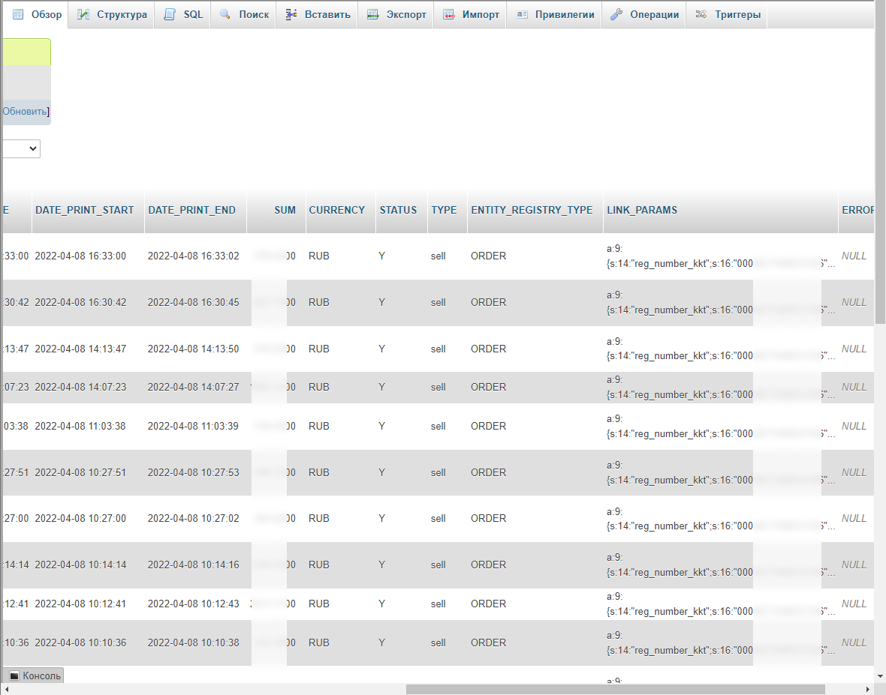
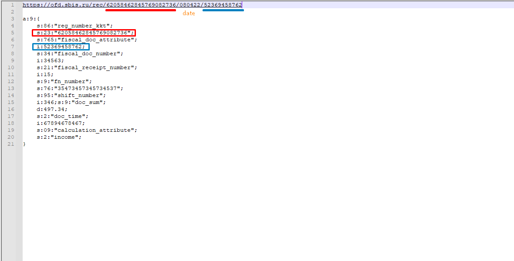
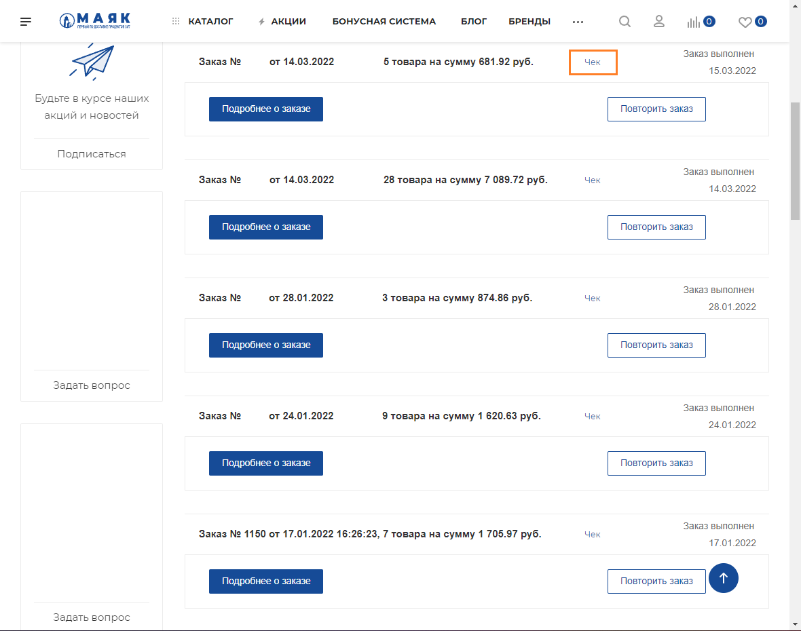

# sbis-check-parsing

> **commercial development**

Script for the order list page in the user's personal account ([Mayak](https://mayak.art)). 
Pulls raw data from the database, parses it and shows it on the page.

### Task 
Find checks in the system. 
Display a link to the check in the user's personal account.

### Features 
- database connecting
- creation SQL query
- strings - explode(), substr()
- building a link from a raw data

### Table with checks

### Link example and raw data from database

### List of check links

